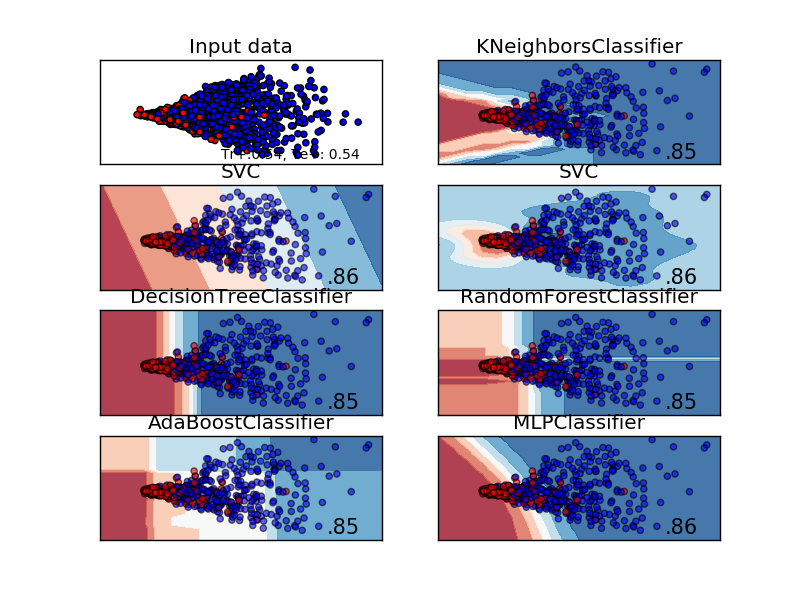
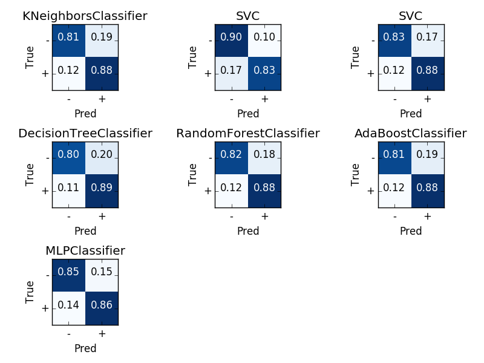
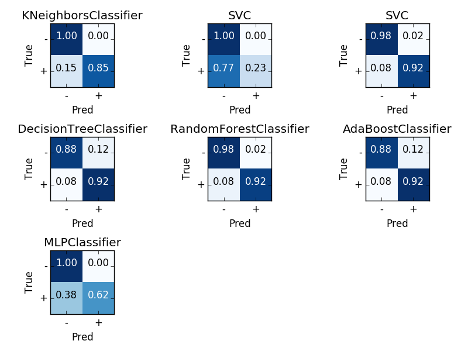

## 17-12-2016
This day was spent getting familiar with the data. The data was taken from the course web :https://www.kth.se/social/files/547d95adf276544940c0ad5f/spdata.tar.gz

Methods were coded to parse it into Python and to split it into training and test sets. This done using biopythonIO to load each sequcence.
And triming it to length 40. This was as in :http://www.cbs.dtu.dk/services/SignalP/paper-3.0.pdf .

Split in to training and testing split was done using a  sklearn's *train_test_split. This was pretty straight for was to use. More details here
http://scikit-learn.org/stable/modules/generated/sklearn.model_selection.train_test_split.html

## 18-12-2016
A research was started to find the best method to represent the protein sequences in a way that improves accuracy of our classifiers.
The idea here was to create some sort of 'bag of words' representation that the clasifiers can train on. More on bag of words can be found here: https://en.wikipedia.org/wiki/Bag-of-words_model

## 20-12-2016
A typical method of K-gram vectorizing followed by Feature Hashing , as such we transformed the input using these techniques.
This basically finds the most occuring short sub-sequnces and uses a count of them as features. We looked at subsequences of bewteen 3-6 AA.
Python's sklearn library has very good implementations of the K-gram vectorizing. This can be found here :http://scikit-learn.org/stable/modules/generated/sklearn.feature_extraction.text.CountVectorizer.html
There are two very nice examples out of examples at the bottom of the page. 

## 21-12-2016
After realising that the feature space that I had created the day before was very sparse - Since of K-grams do not appear at all in some sequences.
I decided to form a dimentionality reduction to a 2d space using singular value decomposition. This was done using `TruncatedSVD()` function in sklearn.
## 30-12-2016
A set of classical classifiers were chosen to begin our experimentations. Since it is very easy to fit most of them using sklearn we decided to train a couple of classifers.
The list of classifers avalible in sklearn can be found here :http://scikit-learn.org/stable/supervised_learning.html#supervised-learning
We used the following classifers:

Classifier|
------------|
KNN|
SVC -With Linear Kenerl| 
SVC -With Radial Basis Function Kernerl|  
Decision Tree| 
Random Forest| 
Adaboost|
MLP|

## 02-01-2017
Plotting functions were made, where each one of the classifiers were plotted with its accuracy alongside its decision boundary. Confusion matrices were also plotted as to better understand the results.
This day was spent trying to empirically discover the arguments that would lead to the best accuracy for finding the signal peptide, for both transmembrane and non-transmembrane samples.

The plot above shows test perfomance of the different classifiers on non transmembrane data . Top left graph shows a 2d projection of the feature data with colors corroesponding to each class( with SP or no SP). Each of the other graphs depicts the decision boundries between different classes is shown by the different colours  - the number at the bottom right of the graphs is the overall test accuracy. In this case we can see that the MLP and SVC- rbf seem to be slightly better than the others.

Confusion matrices on the same data is shows the true postive/negative and false postive/negative rates of each classifer.

Perfromance on transmembrane data was similar but however the was a marked increase in fales negative rate in MLP as the data was baised towards the negative in the transmembrane data set this can be seen below. The ensamble methods such as adaboot and random forest better managed this bias.

## 04-01-2017
I added the above findings in the report.

