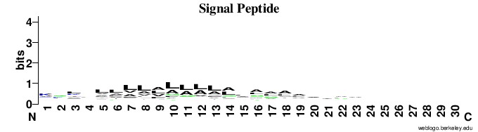
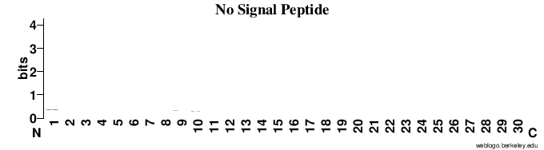

## 15-12-2016
Met with team to discuss the work. Talked about features - Helder mentioned hashing could be useful. We would all reasearch more. There was also some talk about HMMs.
## 22-12-2016
I stated reading about related works in this area. The notable work was *Improved prediction of signal peptides* by Bendtsen etal. This is the paper behind the SignalP service which is very popular. They use HMM and NN. They also trim the sequecnces to 60 AAs. This was very usefull since our classifers did not work well of very long sequences. This paper can befoudn here :http://www.cbs.dtu.dk/services/SignalP/paper-3.0.pdf .
I then creasted a shared latex document for the team.
## 08-12-2016
I also read some of the other related works that were cited by the Signal P paper. A notable one was a review of the the current web-severs avalible for this protein atribute prediction. The most relevent servers for signal pedtited prediction that were reviewed were Signal-3L and Signal-CF. This paper can be found here : http://file.scirp.org/pdf/NS20090200001_67266211.pdf .  
## 03-01-2017
I was then working on visualizing signal peptides using weblogo as recomended. I decided to take one sequence file from the positve examples and compare it with one of the negatives. The results where as follows:

 
It is clear that the A and L proteins affected the signal peptides. I also removed the first amino acids as it made visualisation difficult, it was too heavily loaded in all files.

For future reference the weblogo service can be found here :http://weblogo.berkeley.edu/logo.cgi

## 05-01-2017
Wrote the the findings in the report including the weblogo difference in the sequences. Observation: The sequence logos are very sparse in the sequences without signal Peptides and for sequences with signal peptides tend to have a high densities of amino acids Lysine (L) and Alanine (A) in postions 5 to 20. Sequences without peptides tend not have any dominant amino acids

## 08-01-2017
Wrote the abstract and edited grammatical and language errors in the report. Also performed a final completeness check over the report and code. 

